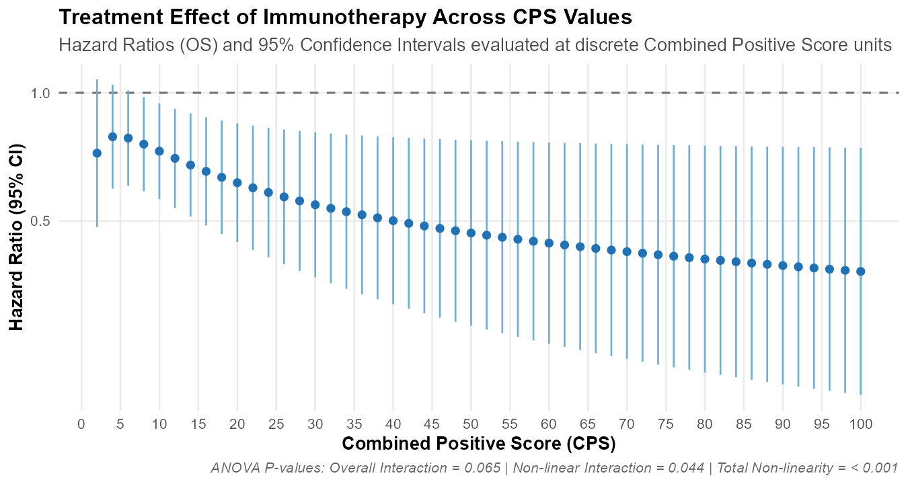

<!-- README.md -->
<p align="center">
  
</p>

<h1 align="center">cps</h1>
<p align="center"><b>Reproducible continuous PD-L1 CPS modeling for first-line immunotherapy<br>
in advanced gastric / gastroesophageal junction adenocarcinoma</b></p>

<p align="center">
  = 4.1">
  
  
  
  
</p>

---

`cps` bundles a **de-identified** patient-level dataset (1040 patients, the
patient identifier removed) and a small set of functions that **regenerate every
table and figure** of the AGAMENON analysis from that single data frame — so the
results are fully auditable and reproducible.

The analysis compares three ways of using the PD-L1 Combined Positive Score
(CPS) to guide immunotherapy: **dichotomized** thresholds (≥1, ≥5, ≥10),
**non-overlapping intervals** (<1, 1–4, 5–9, ≥10) and a **continuous restricted
cubic spline**.

## Installation

```r
# from GitHub
remotes::install_github("albertocarm/cps")

# or from a local copy of the repository (a folder or a built tarball)
remotes::install_local("cps")        # or: devtools::install("cps")
```

Depends on `rms`; imports `survival`, `Hmisc`, `gtsummary`, `ggplot2`.

## Quick start

```r
library(cps)

data(agamenon_cps)            # 1040 x 16, minimal analysis variables only

cps_table1()                  # Table 1  - baseline characteristics by arm
cps_distribution()            # CPS binary thresholds + non-overlapping intervals

fit <- cps_fit()              # multiple imputation (m = 10) + all models
fit$interaction_p             # interval / spline / nonlinear interaction p-values

cps_table2(fit)               # Table 2  - HR by CPS subgroup (vs EPAR / Leone)
cps_model_comparison(fit)     # Suppl. Table S4 - AIC / C-index / R2
cps_figure_hr()               # Figure 4 - HR across the continuous CPS spectrum
```

## What's inside

| Function | Reproduces |
|---|---|
| `cps_prepare()` | recoding: arm, CPS intervals/thresholds, hepatic burden, `log_cps` |
| `cps_table1()` | **Table 1** — baseline by treatment arm |
| `cps_distribution()` | CPS distribution (thresholds + intervals) |
| `cps_fit()` | imputation + dichotomized / interval / spline interaction models |
| `cps_table2()` | **Table 2** — immunotherapy HR by CPS subgroup |
| `cps_model_comparison()` | **Suppl. Table S4** — model comparison |
| `cps_figure_hr()` | **Figure 4** — HR(CPS) curve |

## The dataset

```r
str(agamenon_cps)
```

`SGm` (OS, months), `Die`, `Immunotherapy` (1 = CT+ICI, 0 = CT alone), `cps`
(PD-L1 CPS; `NA` = not tested), plus the clinical covariates used in the models
(ECOG, grade, sex, age, Lauren histology, signet-ring, hepatic burden, ascites,
bone, number of metastatic sites, NLR, oxaliplatin backbone, albumin, and year
of treatment initiation). **Only the variables needed to reproduce the
manuscript are shared** — the
patient identifier and other fields have been removed so individuals are not
traceable. Derived columns (`log_cps`, CPS categories, treatment arm) are
rebuilt by `cps_prepare()`.

## Key result (reproducible)

<p align="center">
  
</p>

**This figure is the heart of the paper.** It shows the hazard ratio for
immunotherapy versus chemotherapy across the entire PD-L1 CPS range: the benefit
is uncertain at low CPS (the 95% CI crosses 1), becomes clearly favourable around
CPS ≈ 10, and deepens to roughly HR 0.4 at the highest scores. A single fixed
cutpoint cannot capture this smooth gradient — modelling CPS as a continuous
score can. It is reproduced exactly by `cps_figure_hr()`.

The immunotherapy hazard ratio decreases across CPS subgroups, reaching its
lowest value in the CPS ≥ 10 stratum. When CPS is modelled as non-overlapping
intervals the CPS-by-treatment interaction is significant (p ≈ 0.02), and the
continuous spline gives the lowest AIC of the specifications compared (ΔAIC ≈ 3
versus the interval model) with a significant non-linear component (p ≈ 0.04).

| CPS subgroup | HR for OS (CT+ICI vs CT alone) |
|---|---|
| ≥1 | 0.74 (0.59–0.93) |
| 1–4 | 1.24 (0.61–2.51) |
| **≥5** | **0.70 (0.51–0.96)** |
| 5–9 | 1.07 (0.68–1.69) |
| **≥10** | **0.45 (0.30–0.68)** |

Numbers are reproduced by `cps_table2()` / `cps_model_comparison()` (seed 123).

## Reproducibility & provenance

- The bundled dataset is de-identified (patient identifier removed).
- `tests/` (testthat) check the cohort, the CPS distribution and the key model
  outputs against the published numbers.
- Figures and tables are produced from the same data frame, so every number is
  traceable.

## Citation

> AGAMENON-SEOM investigators. Continuous PD-L1 CPS modeling outperforms
> dichotomized thresholds for immunotherapy in advanced gastric/GEJ
> adenocarcinoma. *(manuscript in preparation).* Registry: AGAMENON-SEOM,
> ClinicalTrials.gov **NCT04958720**.

## License

MIT © AGAMENON-SEOM Investigators. Data are shared de-identified for
reproducibility; not for clinical decision-making.
